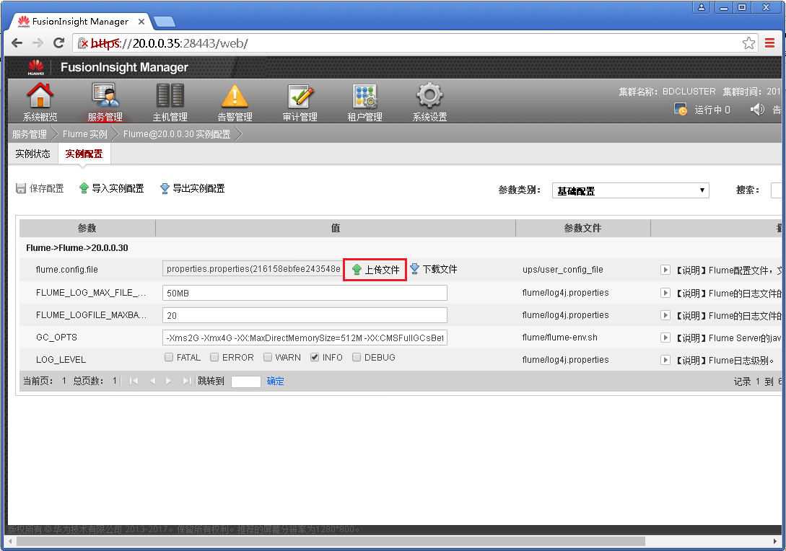
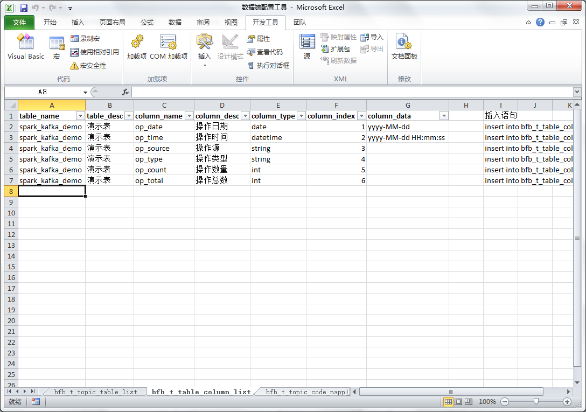

# DataService-Framework

#### 项目介绍
基于大数据平台的数据处理服务框架。
使用Flume组件采集系统日志，并将采集到的日志存放到Kafka消息队列，供SparkStreaming程序消费使用。软件的目的是实现日志文件的实时采集，并实时加工处理到数据库，供其他服务程序使用。

#### 依赖组件
项目基于FusionInsight HD V100R002C70SPC200平台，依赖以下组件：  
1. Java: 1.8  
2. Scala: 2.10.4
3. Flume: 1.6.0
4. Kafka: 0.8.2.1 / 0.10.0.0
5. Spark: 1.5.1

#### 软件架构
软件结构如下：  
DataService-Framework 项目根目录  
+ commons：公共功能模块，提供配置文件读取、数据库连接、日志打印、工具类等公共功能，以供其他模块调用。  
+ kafka-streams：主题数据过滤模块，Kafka自带的流处理功能，业务系统记录的日志如果包含了大量的：程序异常日志、数据库操作日志、调试日志等日志信息，而采集的数据只需要日志文件中的特定数据的日志记录，那么对于我们采集到的日志来说，可能会有90%以上的日志都是垃圾数据，但是Flume组件没有提供日志过滤功能，而Spark程序又不应该消费这些数据。这时就需要提供一个中间层，将Flume采集到的Topic1的日志中满足条件的数据筛选出来放到Topic2中，Spark程序只需要消费Topic2的数据即可，过滤条件按照正则表达式进行配置。这样Spark消费Topic2的数据都是我们需要的数据，并且我们可以及时的清理掉Topic1的数据以释放空间。
+ spark-kafka：Spark程序处理模块，通过SparkStreaming程序，准实时消费Kafka中的数据，经过字段数据解析、码值标准化处理等操作后，落地到DB中，供其他程序、服务使用。

#### 功能扩展
目前，软件实现了Flume数据采集、Kafka主题数据过滤、SparkStreaming实时数据处理。但是SparkStreaming的数据处理只实现了代码值标准化等基础功能。并且，目前默认支持的采集日志格式只有两种：分隔符分隔字段的数据、JSON格式的数据。  
功能扩展可以从两个方面进行：
1. SparkStreaming程序扩展，可以继续增加程序处理功能，完成更复杂的数据处理，比如：指标加工、客户行为分析、客户画像等
2. 日志格式扩展，目前只开发了支持两种类型的日志格式，可以自定义类实现com.service.data.spark.streaming.process.TopicValueProcess接口，以实现其他格式的日志内容的解析。自定义实现类后，需要在spark-kafka模块的resources/META-INF/services/com.service.data.spark.streaming.process.TopicValueProcess文件中添加一行记录类名称，并且在使用过程中将其配置到数据库中即可。

#### 使用说明
数据端配置工具：[数据端配置工具.xlsx](works/docs/%E6%95%B0%E6%8D%AE%E7%AB%AF%E9%85%8D%E7%BD%AE%E5%B7%A5%E5%85%B7.xlsx)  
环境搭建部署文档：[环境搭建部署文档.docx](works/docs/%E7%8E%AF%E5%A2%83%E6%90%AD%E5%BB%BA%E9%83%A8%E7%BD%B2%E6%96%87%E6%A1%A3.docx)  
软件开发打包文档：[软件开发打包文档.docx](works/docs/%E8%BD%AF%E4%BB%B6%E5%BC%80%E5%8F%91%E6%89%93%E5%8C%85%E6%96%87%E6%A1%A3.docx)  

#### 部分截图
Flume服务端配置文件下载
  
Flume服务端配置文件上传
  
Flume服务端配置文件生效
  
Flume客户端软件下载
  
Flume客户端采集配置
  
Kafka Topic监控
  
数据库配置项配置
  
表结构配置
  
Spark on Yarn 监控
  
产生分隔符分隔的数据
  
产生JSON格式数据
  
数据处理结果验证
  

#### 安装教程

1. xxxx
2. xxxx
3. xxxx

#### 参与贡献

1. Fork 本项目
2. 新建 Feat_xxx 分支
3. 提交代码
4. 新建 Pull Request

#### 码云特技

1. 使用 Readme\_XXX.md 来支持不同的语言，例如 Readme\_en.md, Readme\_zh.md
2. 码云官方博客 [blog.gitee.com](https://blog.gitee.com)
3. 你可以 [https://gitee.com/explore](https://gitee.com/explore) 这个地址来了解码云上的优秀开源项目
4. [GVP](https://gitee.com/gvp) 全称是码云最有价值开源项目，是码云综合评定出的优秀开源项目
5. 码云官方提供的使用手册 [https://gitee.com/help](https://gitee.com/help)
6. 码云封面人物是一档用来展示码云会员风采的栏目 [https://gitee.com/gitee-stars/](https://gitee.com/gitee-stars/)